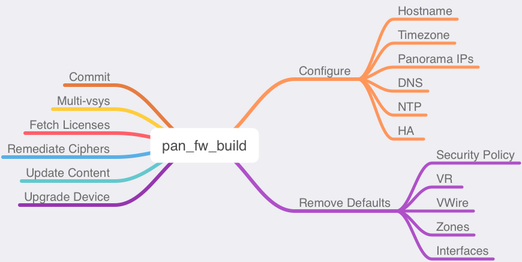

# pan_fw_build

A script to assist with firewall build configurations



## Built With

[Docker](https://www.docker.com/products/docker-desktop)  
[Palo Alto Networks PAN-OS SDK for Python](https://github.com/PaloAltoNetworks/pan-os-python)

## Deployment

All files within the folder should be deployed in the same directory for proper file execution.

## Prerequisites

Update `config.py` file with correct values before operating.

```
# CONNECTIVITY CONFIGURATIONS
# Update password with the new password entered during management IP
# configuration. Also, update the firewall_ip section with either 1 IP
# address for a standalone firewall or 2 IP addresses for a HA cluster.
#
# Firewall IP Examples
# 1 IP - ['1.1.1.1']
# 2 IPs - ['1.1.1.1', '2.2.2.2']

paloalto = {
    'username': '<USERNAME>',
    'password': '<PASSWORD>',
    'key': '<API_KEY>',
    'firewall_ip': ['<IP_ADDRESS>']
    }

# MANAGEMENT CONFIGURATIONS
# These are the initial management configurations until templates can be
# pushed from Panorama. If deploying a HA cluster then update hostname1 and
# hostname2, but if deploying a standalone device only update hostname1.
#
# hostname1 is the Primary
# hostname2 is the Secondary

hostname1 = '<HOSTNAME1>'
hostname2 = '<HOSTNAME2>'
timezone = '<TIMEZONE>'
pano_primary = '<PRIMARY_PANORAMA>'
pano_secondary = '<SECONDARY_PANORAMA>'
dns_primary = '<PRIMARY_DNS>'
dns_secondary = '<SECONDARY_DNS>'
ntp_primary = '<PRIMARY_NTP>'
ntp_secondary = '<SECONDARY_NTP>'

# DO NOT UPDATE
# Used for comparison during rerunning the script
device1_settings_list = [hostname1, timezone, dns_primary, dns_secondary, pano_primary, pano_secondary, ntp_primary, ntp_secondary]
device2_settings_list = [hostname2, timezone, dns_primary, dns_secondary, pano_primary, pano_secondary, ntp_primary, ntp_secondary]

# HA CONFIGURATIONS
# Update mode to either Active/Passive or Active/Active depending on the HA
# deployment.

mode = ''

# PAN-OS VERSION
# Update version with the PAN-OS version the firewall is needed to be
# upgraded to.

version = '<PANOS_VERSION>'

# Multi-vsys
# Update multivsys to 'on' to turn on multi-vsys.  Default setting is off.

multivsys = 'off'
```

## Operating

From the CLI, change directory into the folder containing the files.  The following command will execute the script:

```bash
docker-compose up
```

After the script has completed or if the script needs to be reran, issue the following command:

```bash
docker-compose down --rmi all
```

## Example Output

See the [script_output](script_output.md) file for an example of the output from the script.

## Changelog

See the [CHANGELOG](CHANGELOG) file for details

## License

This project is licensed under the MIT License - see the [LICENSE](LICENSE) file for details
